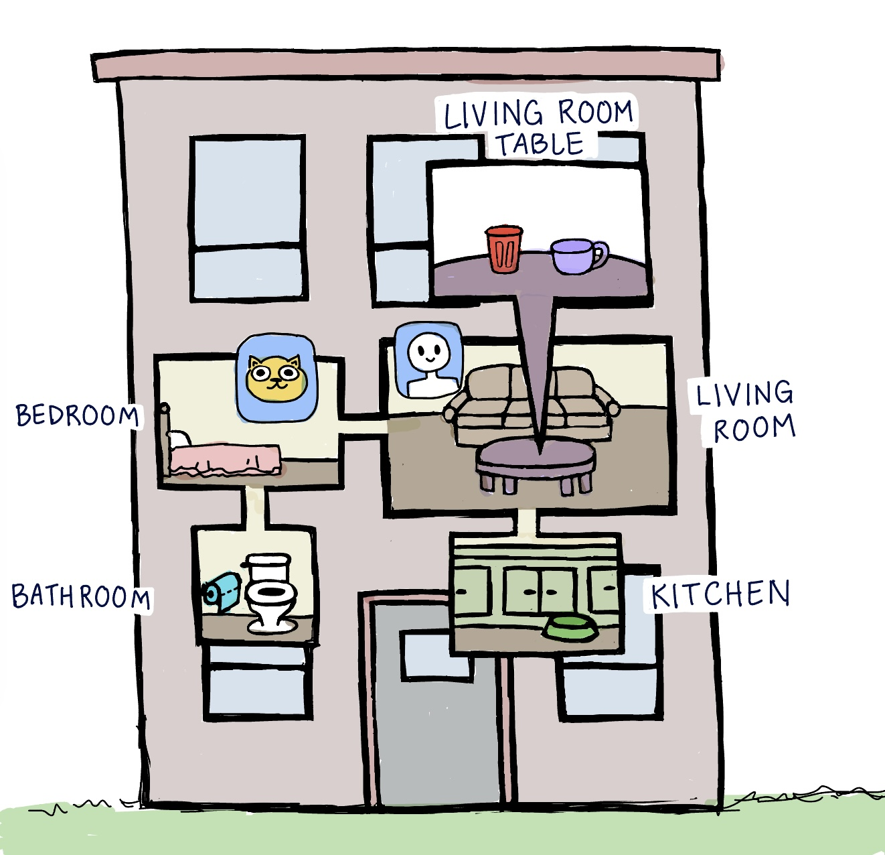

# The Cat Revenge Game

Main Plotline:
* In the Cat Revenge text adventure game, you're a cat on a mission of petty revenge.
Your owner skimped on your late night treats, and you're not having it. How dare they
forget to feed you your reward for being a good cat?! Your plan? Knock their favorite
mug right off the table to show 'em who's boss. Sneak around and use your slick cat
skills to get that satisfying crash. It's all about being a little bit naughty and a
whole lot of cat-like. Get ready to make your move and let that mug meet its fate!

  Why we picked the topic:
* We wanted to make a game in the perspective of a cat and simple revenge.
To put it simply, we love cats even though they push things off the table sometimes.

  Cat Revenge related files:
- my_game_done_testing.ipynb ->  Is the final version of the Cat Revenge game.
- my_game.ipynb -> Is the initial version of the Cat Revenge game, contains test code.
- playthrough.txt -> Contains a playthrough of the Cat Revenge game and all its functions.
- cat_game.jpg -> Has a drawn out map of the game.

<!--  -->
  Cat Revenge Game Map:

***
# Action Castle Game

Action Castle related files:
- action_castle_final.ipynb ->  Is the final version of the Cat Revenge game.
- my_game.ipynb -> Is the initial version of the Cat Revenge game, contains test code.
- playthrough.txt -> Contains a playthrough of the Cat Revenge game and all its functions.
- cat_game.jpg -> Has a drawn out map of the game.
